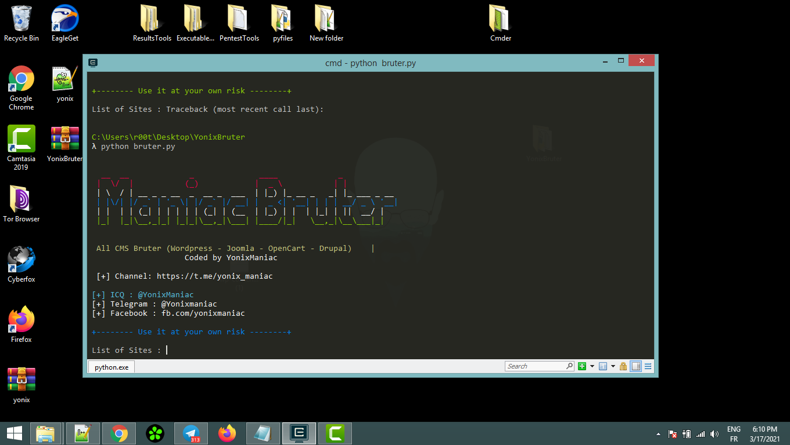

# ManiacBruter
[New] Maniac Bruter - All in One (Wordpress - Joomla - OpenCart - Drupal) - Multi Threading

Tutorial : https://www.youtube.com/watch?v=_12E5RMMNjE

*Tool*
----
```
Bruter : 
* Wordpress
* Joomla
* Drupal 
* Opencart
```
*Useful?*
----
```
Yes .. You can see : 
* MultiThreading
* Proxyless (fresh config)
```
*To get it*
---
```
Link Download : https://t.me/yonix_maniac/26
```
*using*
----
**Linux**
```bash
apt install git python3-pip
git clone https://github.com/yonixmaniac/ManiacBruter
cd ManiacBruter
pip install colorama requests
python bruter.py
```
**Windows**
```
install from https://python.org/downloads
open cmd
pip install requests
pip install colorama
cd ManiacBruter
python bruter.py
```

